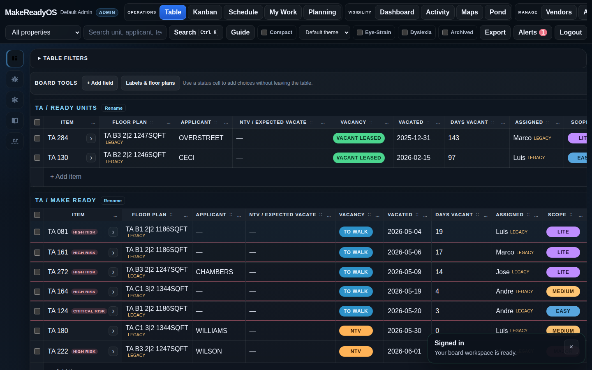
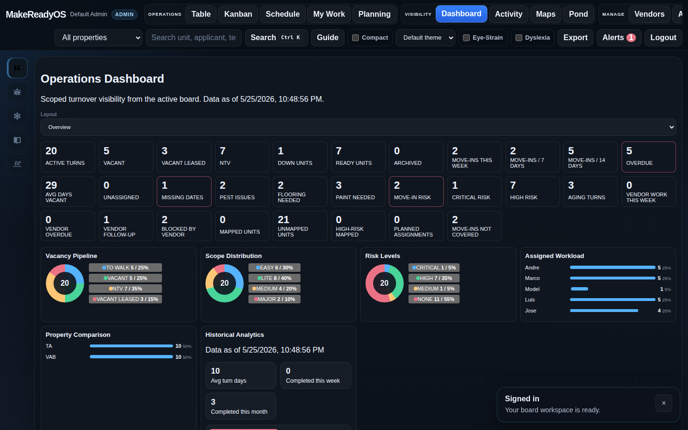
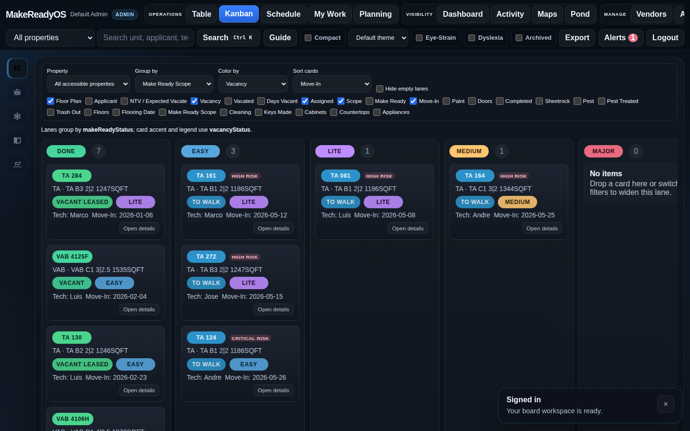
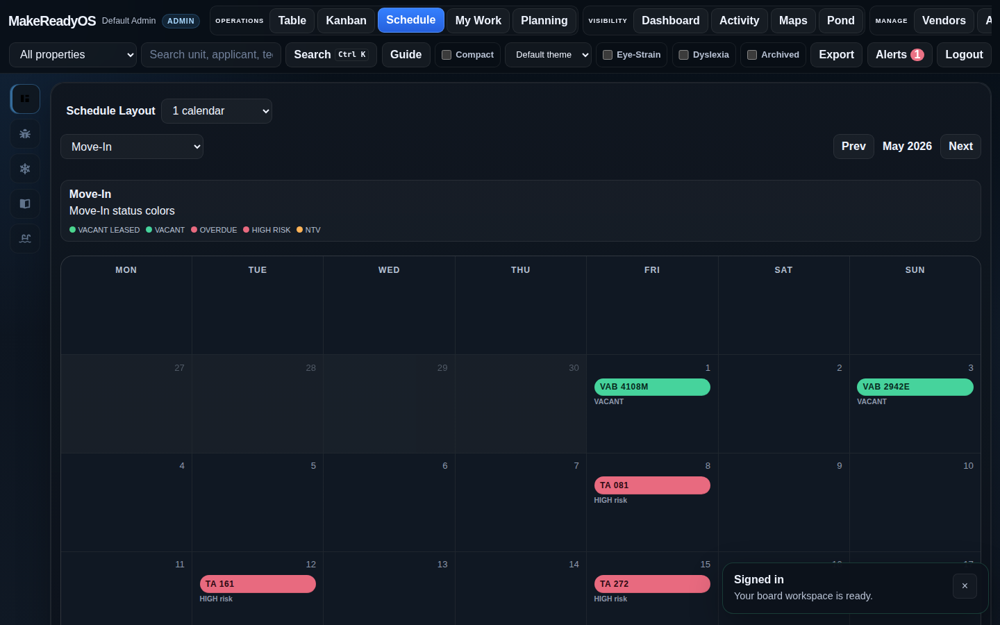
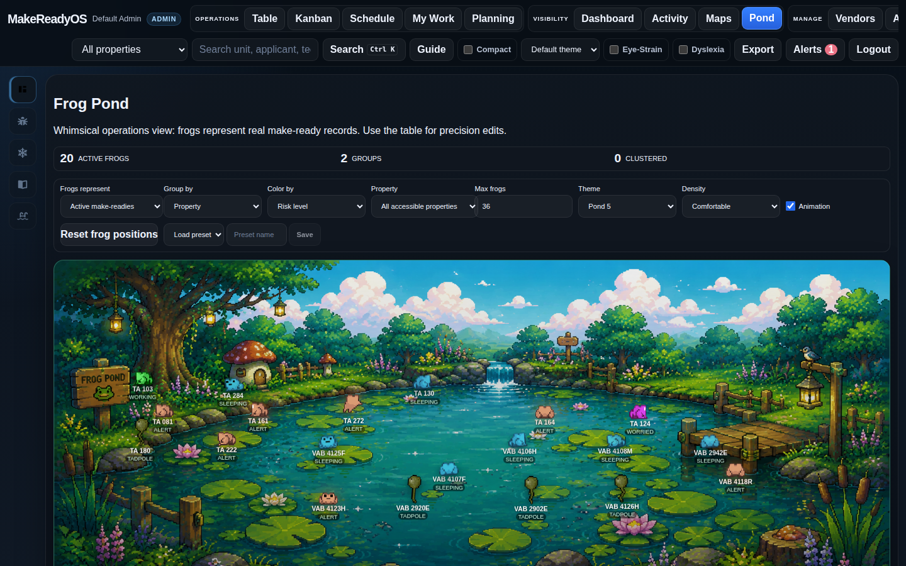

# MakeReadyOS

MakeReadyOS is a self-hosted property operations platform focused on apartment make-ready and maintenance workflows. It uses a dense software-defined spreadsheet workflow built for local ownership, Docker deployment, and property maintenance operations.

The core workflow is a fast table-first make-ready board with Kanban, Schedule, Dashboard, item drawer, comments, attachments, checklists, vendors, preventive maintenance, refrigerant tracking, pool/spa logging, risk scoring, automations, property maps, and a Frog Pond visualization.

## What MakeReadyOS Is / Is Not

MakeReadyOS is:

- A self-hosted operations board for property maintenance and apartment turns.
- A table-first daily workflow for supervisors, techs, leasing, cleaners, and managers.
- A local-first system for make-ready tracking, comments/photos, checklists, vendors, scheduling, automations, risk visibility, and operational reporting.
- An open-source foundation for integrations through documented JSON/API contracts.

MakeReadyOS is not:

- A property-management accounting system.
- A resident ledger, rent collection, or leasing CRM replacement.
- A vendor compliance platform like NetVendor.
- A public SaaS service or hosted marketplace.
- A plugin runtime for arbitrary untrusted JavaScript.

## Screenshots

| Table | Dashboard |
| --- | --- |
|  |  |

| Kanban | Schedule |
| --- | --- |
|  |  |

| Frog Pond |
| --- |
|  |

## What It Includes

- Dense make-ready table with inline editing, custom fields, managed labels, floor plans, structured server-side board filters, batch actions, and archive/restore workflows.
- Kanban, Schedule, Dashboard, Activity, My Work, Planning, Vendors, Preventive Maintenance, Refrigerant, Pool Log, Maps, Frog Pond, Automations, Setup, Fields, Admin, and Integrations workspaces.
- Preventive Maintenance includes recurring templates, due-task generation, history, printable reports, attachments, and Property Wiki references.
- Pool Log includes daily readings, safety checks, chemical additions, printable reports, scoped photos/PDFs, and in-app review reminders.
- Authentication, roles, property-scoped permissions, audit logs, API tokens, and in-app notifications.
- Optional SMTP-backed new-user invite emails from Admin when operators want login details delivered to the user's email address.
- English/Spanish user language preferences for the sign-in flow, core app shell, dashboard shell, connection/offline status messaging, and user-management workflow. Module-level workflow translation is still an active hardening pass.
- Mobile browser install support through a Progressive Web App manifest and app-like home-screen launch.
- Local attachments/photos, item comments, checklist templates, item drawer, unit history, analytics snapshots, and risk scoring.
- Scoped integration API with examples and a lightweight OpenAPI contract at `/api/openapi.json`.
- Docker Compose, PostgreSQL, Prisma, Fastify, React, Vite, TypeScript, backup scripts, and deployment docs.

For a fuller feature walkthrough, see [docs/PRODUCT_OVERVIEW.md](docs/PRODUCT_OVERVIEW.md) and [docs/FEATURE_STATUS.md](docs/FEATURE_STATUS.md).

## Stack

- `apps/api`: Node 20, Fastify 5, Prisma, PostgreSQL
- `apps/web`: React, Vite, TypeScript
- `docker-compose.yml`: web, API, and PostgreSQL services
- Root scripts for build, test, E2E, backups, automation runs, analytics snapshots, webhook delivery runs, and diagnostics

## Quick Start With Docker

Requirements:

- Docker and Docker Compose
- Node.js 20+ if running scripts outside containers

```bash
git clone https://github.com/nextcode4u/MakeReadyOS.git
cd MakeReadyOS
cp .env.example .env
docker compose up --build -d
```

Before exposing the app beyond `localhost`, set `APP_URL` in `.env` to the real browser URL operators will use:

```bash
APP_URL=http://192.168.0.105:8080
```

Reverse-proxy / DuckDNS example:

```bash
APP_URL=https://csmros.duckdns.org
TRUST_PROXY=true
```

Open:

- Web UI: `http://localhost:8080`
- API health: `http://localhost:4000/health`

Default admin credentials come from `.env`. With the provided example values:

```text
admin
ChangeThisAdmin!23456
```

Change `ADMIN_USERNAME`, `ADMIN_EMAIL`, `ADMIN_PASSWORD`, and `SESSION_COOKIE_SECRET` before using a real deployment. `ADMIN_EMAIL` is optional for sign-in and invite emails, but `ADMIN_USERNAME` or `ADMIN_EMAIL` must be set.

The example environment starts as a blank operational workspace: no sample properties, units, or turns are created, but baseline make-ready labels, table columns, checklist templates, and schedule tracks are ready. Set `SEED_DEMO_DATA=true` only when you want sample properties and records for evaluation.

For deployment details, including Raspberry Pi/VM notes, updates, migrations, backups, upload volume handling, and restore, see [docs/DEPLOYMENT.md](docs/DEPLOYMENT.md), [docs/DISASTER_RECOVERY.md](docs/DISASTER_RECOVERY.md), and [docs/BACKUP_AND_TRANSFER.md](docs/BACKUP_AND_TRANSFER.md).

For EPA 608-friendly refrigerant tracking, tank lifecycle rules, recovery workflow, and exports, see [docs/REFRIGERANT.md](docs/REFRIGERANT.md).

For daily pool/spa readings, safety checks, chemical additions, and chemistry review, see [docs/POOL_LOG.md](docs/POOL_LOG.md).

For recurring filter changes, seasonal routines, PM templates, task history, and PM exports, see [docs/PREVENTIVE_MAINTENANCE.md](docs/PREVENTIVE_MAINTENANCE.md).

## Local Development

```bash
npm install
npm --prefix apps/api install
npm --prefix apps/web install
npm --prefix apps/api run db:migrate
npm --prefix apps/api run seed
npm run dev
```

For local demo data, set `SEED_DEMO_DATA=true` before running the API seed.

Local dev endpoints:

- Web UI: `http://localhost:5173`
- API: `http://localhost:4000`

For disposable local databases, `npm --prefix apps/api run db:push` can be used as a fast schema-sync fallback. For shared or production-like environments, use versioned Prisma migrations.

## Mobile Install

On supported mobile browsers, MakeReadyOS can be installed to the home screen as a Progressive Web App. Android/Chrome shows an optional install prompt when available, with a `Continue in browser` bypass. iOS users can use the browser share menu and choose `Add to Home Screen`.

The current PWA support is for app-like launch and static shell caching. Operational API data and uploaded files are not cached for offline edits.

## Build And Test

```bash
./doctor.sh
./build.sh
./test.sh
./e2e.sh
./run-automations.sh
./run-analytics-snapshot.sh
npm --prefix apps/api audit --omit=dev
npm --prefix apps/web audit --omit=dev
```

Build, test, E2E, automation, and analytics scripts write timestamped logs under `logs/`.

More detail: [docs/BUILD_AND_TEST.md](docs/BUILD_AND_TEST.md).

## Backups

Native JSON export/import is for MakeReadyOS-to-MakeReadyOS operational transfer. PostgreSQL and upload backups are for disaster recovery.

```bash
./backup-db.sh
./backup-uploads.sh
./prune-backups.sh --dry-run
```

Restore scripts are intentionally confirmation-gated:

```bash
./restore-db.sh backups/makereadyos-db-YYYYMMDD-HHMMSS.dump
./restore-uploads.sh backups/makereadyos-uploads-YYYYMMDD-HHMMSS.tgz
```

See [docs/BACKUP_AND_TRANSFER.md](docs/BACKUP_AND_TRANSFER.md), [docs/DISASTER_RECOVERY.md](docs/DISASTER_RECOVERY.md), and [docs/SCHEDULED_BACKUPS.md](docs/SCHEDULED_BACKUPS.md).

## Updates

For most self-hosted installs:

```bash
./update.sh --pull --yes
```

`update.sh` now works on both:

- hosts with local `node`/`npm`
- Docker-only hosts where Prisma migration deploy should run inside the `api` container

Photo uploads are local-first. `MAX_UPLOAD_MB=0` disables MakeReadyOS' per-file API limit so high-resolution phone/HDR photos are not blocked by the app, though browsers, disk space, and external reverse proxies can still impose limits. The inspection gallery supports multi-file upload, in-app preview, markup pins, explicit per-file download, and filtered ZIP export. Use `UPLOADS_HOST_PATH` when uploads should live on a host directory, external drive, or NAS/Samba mount. The Admin storage screen can inspect the active upload path, validate a proposed NAS path, and route new uploads into property-specific subfolders, but Docker still needs the host path mounted and the stack restarted. Existing root-level upload files can be previewed and moved into property folders with `./route-existing-uploads.sh`.

## Documentation

Start here:

- [Product Overview](docs/PRODUCT_OVERVIEW.md)
- [Architecture](docs/ARCHITECTURE.md)
- [Architecture Inventory](docs/ARCHITECTURE_INVENTORY.md)
- [Deployment](docs/DEPLOYMENT.md)
- [Onboarding](docs/ONBOARDING.md)
- [Build And Test](docs/BUILD_AND_TEST.md)
- [Release Process](docs/RELEASE_PROCESS.md)
- [Security](SECURITY.md)
- [Support](SUPPORT.md)
- [Roles And Permissions](docs/ROLES_AND_PERMISSIONS.md)
- [API](docs/API.md)
- [Extensions](docs/EXTENSIONS.md)
- [JSON Schemas](docs/schemas/)
- [Operational Library](docs/OPERATIONAL_LIBRARY.md)
- [Property Templates](docs/PROPERTY_TEMPLATES.md)
- [Risk Engine](docs/RISK_ENGINE.md)
- [Vendors](docs/VENDORS.md)
- [Property Maps](docs/PROPERTY_MAPS.md)
- [Unit Directory And Occupancy](docs/UNIT_DIRECTORY_AND_OCCUPANCY.md)
- [Photo Inspections](docs/PHOTO_INSPECTIONS.md)
- [Pool Log](docs/POOL_LOG.md)
- [Preventive Maintenance](docs/PREVENTIVE_MAINTENANCE.md)
- [Make Ready QA Checklist](docs/MAKE_READY_QA_CHECKLIST.md)
- [Upload Storage](docs/UPLOAD_STORAGE.md)
- [Operating Calendars](docs/OPERATING_CALENDARS.md)
- [Frog Pond](docs/FROG_POND.md)
- [Analytics And History](docs/ANALYTICS_AND_HISTORY.md)
- [Workload Planning](docs/WORKLOAD_PLANNING.md)
- [Performance And Scale](docs/PERFORMANCE_AND_SCALE.md)
- [Roadmap](docs/ROADMAP.md)
- [Release Checklist](docs/RELEASE_CHECKLIST.md)

Contributor-facing docs:

- [CONTRIBUTING.md](CONTRIBUTING.md)
- [Open Source Guide](docs/OPEN_SOURCE_GUIDE.md)
- [Feature Status](docs/FEATURE_STATUS.md)
- [Technical Debt](docs/TECH_DEBT.md)
- [UX Debt](docs/UX_DEBT.md)

## Runtime Asset Rule

`reference/` is local research material and is not a runtime dependency. If an asset is used by the app, it must first be copied into a committed runtime-safe path such as `assets/` or `apps/web/public/`.

Current committed runtime assets include OpenDyslexic fonts, Frog Pond assets, and small Font Awesome placeholder icons.

## License

MakeReadyOS is released under the [BSD Zero Clause License](LICENSE), allowing use, distribution, forks, and modifications without attribution requirements.
